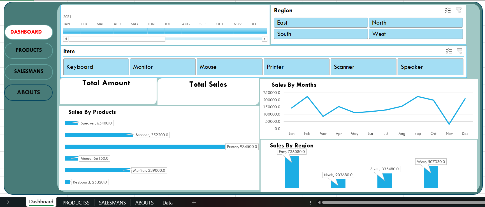

# Excel Sales Dashboard Project

## Project Overview
This project analyzes sales performance using Microsoft Excel and presents the insights through an interactive dashboard.  
The dashboard allows users to explore sales trends by product, region, and salesperson using dynamic filters and visual charts.

The goal of this project is to demonstrate data analysis, visualization, and dashboard development using Excel.

---

## Dashboard Preview

Example:

---

## Features

• Interactive dashboard with slicers for filtering data  
• Sales analysis by product category  
• Sales performance by region  
• Salesman performance analysis  
• KPI metrics for Total Sales and Sales Count  
• Dynamic charts that update based on slicer selection

---

## Project Structure

Workbook Sheets:

Dashboard  
Main interactive dashboard showing sales KPIs and visual insights.

Products  
Product-wise sales analysis and top/least selling products.

Salesmans  
Salesperson performance analysis showing top and poor performers.

About  
Information about the project and developer.

Data  
Raw dataset used to generate PivotTables and visualizations.

---

## Tools Used

Microsoft Excel  
PivotTables  
PivotCharts  
Slicers  
Data Cleaning  
Data Visualization

---

## Key Insights

• Certain products generate significantly higher sales compared to others.  
• Sales performance varies across regions, with some regions contributing the majority of revenue.  
• A small number of salespersons contribute the highest portion of total sales.

---

## Project Purpose

This project demonstrates how Excel can be used as a powerful tool for:

- Data analysis
- Business insight generation
- Interactive dashboard development

---

## Author

Subhankar Chand  
B.Tech CSE (AI & ML)
